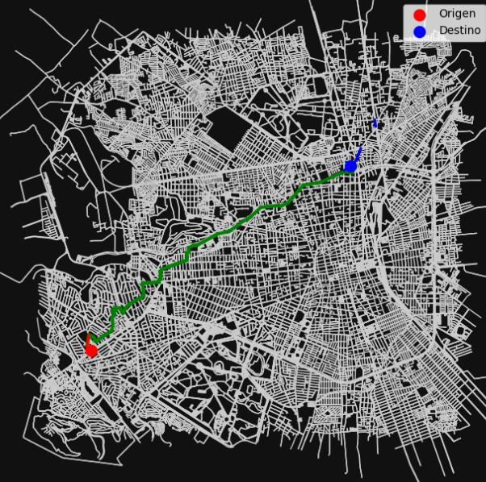

# Urban Navigation System in San Luis Potosí: Dijkstra's Algorithm in C

High-performance implementation of Dijkstra's algorithm for trajectory optimization and shortest path finding in complex urban networks. 

The system is developed entirely in standard C, prioritizing computational efficiency and manual memory management. To maximize search speed and reduce execution times, the engine avoids external data structure libraries and implements the following from scratch:
* **Hash Table:** Node storage system with collision resolution via quadratic probing and dynamic memory resizing (`realloc`).
* **Priority Queue (Min-Heap):** Binary tree structure for constant-time retrieval (O(1)) of the node with the lowest accumulated distance, optimizing the algorithm's iterations.

  

## Requirements and Technologies
* **Language:** C (C99 or higher).
* **Compiler:** GCC, Clang, or MSVC.
* **Libraries:** Standard C Library (`stdio.h`, `stdlib.h`, `string.h`, `stdint.h`, `time.h`, `stdbool.h`). No external dependencies required.

## Data Structures & I/O Files

For the program to run correctly, it requires reading a road network database file and will generate an output file with the results.

### Required Input File
The executable must be in the same directory as the `Mapa.csv` file. This file contains the urban graph information and must strictly follow this format (comma-separated):
`origen,destino,longitud,nombre_calle`

### Output File
Once the shortest path is calculated, the system automatically generates a file named `camino.csv` containing:
1. The source and destination nodes along with the street names.
2. The complete sequence of node IDs that make up the optimal route.

## Compilation and Usage Instructions

1. Open a terminal in the project directory.
2. Compile the source code using GCC (or your preferred compiler):
   `gcc Dijkstra.c -o dijkstra_nav`
3. Run the compiled program:
   * **Windows:** `dijkstra_nav.exe`
   * **Linux/Mac:** `./dijkstra_nav`

## System Interaction
Upon startup, the system will load the CSV file, populate the Hash Table and Min-Heap in memory, and display a console interface.
1. Enter the **source** street name.
2. Enter the **destination** street name.
3. The system will calculate the route and print to the screen:
   * The total route distance in kilometers.
   * The exact execution time of the algorithm.
   * The load time of the data structures.
   * The step-by-step sequence of streets to take.

## Visualizing the Route
The generated `camino.csv` file can be exported to mapping tools or plotting scripts to render the path visually over the city's street network, as shown in the repository's examples.
